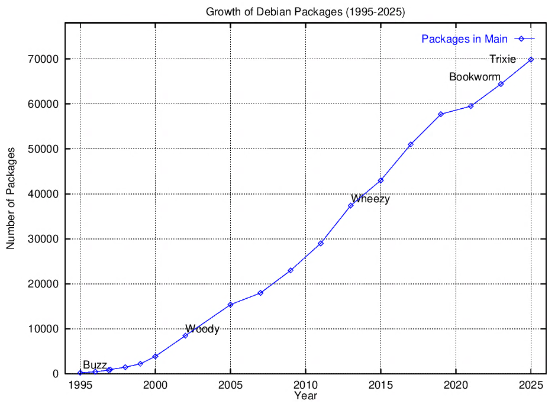

# Debian History Paper


> A LaTeX project documenting the history of Debian package growth, used as a benchmark for TeX workflow compatibility across three decades of Debian releases.

## 📖 Overview

This repository contains a LaTeX document that visualizes the exponential growth of the Debian package repository from 1995 to the present day.

Beyond generating a chart, the primary purpose of this project is to serve as a **compatibility test case**. It is intended to be compiled on various Debian releases running in emulated environments (QEMU/VirtualBox), ranging from the vintage **Debian 0.93R6 (1995)** to the upcoming **Debian 13.0 (Trixie)**.

## 📊 Output Preview


*Figure 1: The trajectory of available software packages in Debian stable releases over time.*

## 🛠️ Prerequisites

To compile this document on old systems (Such as Debian 0.93R6), you need these packages installed:

* `latex` 
* `gnuplot`
* `bibtex`

## 🚀 Usage

### Standard Compilation (Old Debian)

If you are on a old system, use the following commands:

```bash
# 1. Prepare the plot
gnuplot plot.gp

# 2. Compile the document structure
latex debian_intro.tex

# 3. Process the bibliography
bibtex debian_intro

# 4. Link citations and resolve cross-references
latex debian_intro.tex
latex debian_intro.tex

# 5. Convert to PostScript for viweing/printing
dvips debian_intro.dvi -o debian_intro.ps
```
